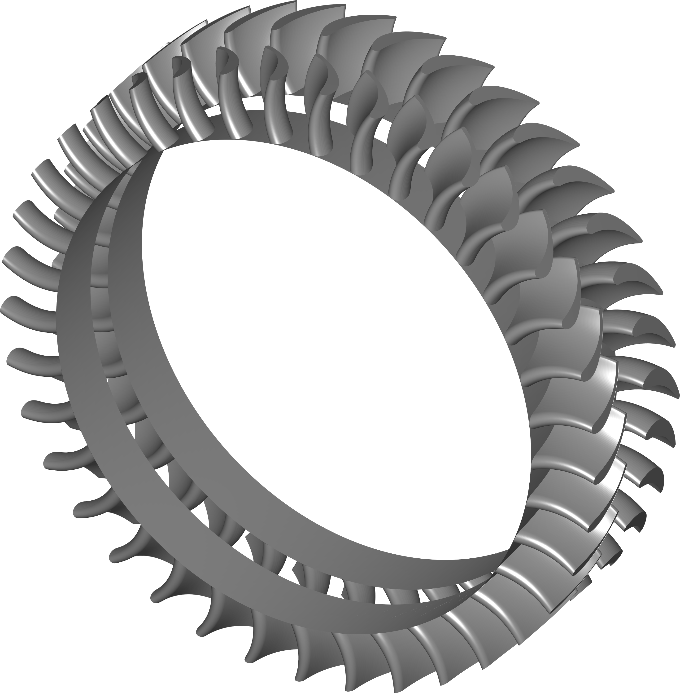
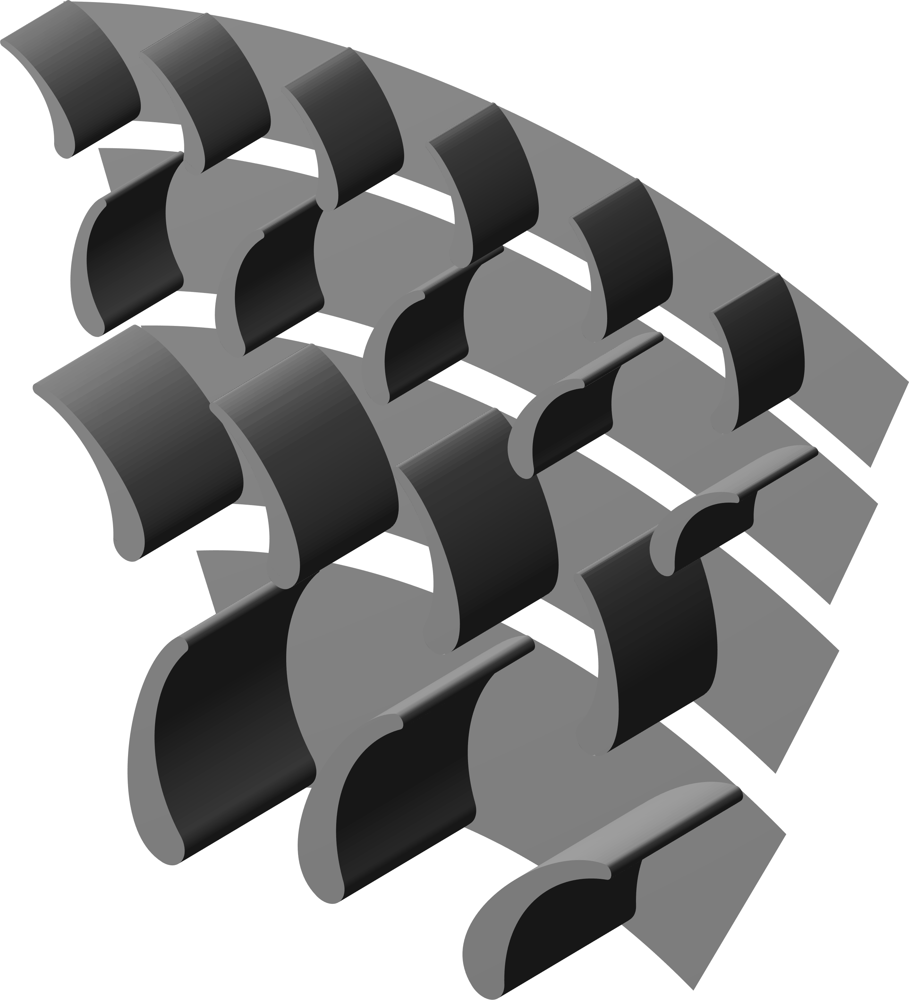
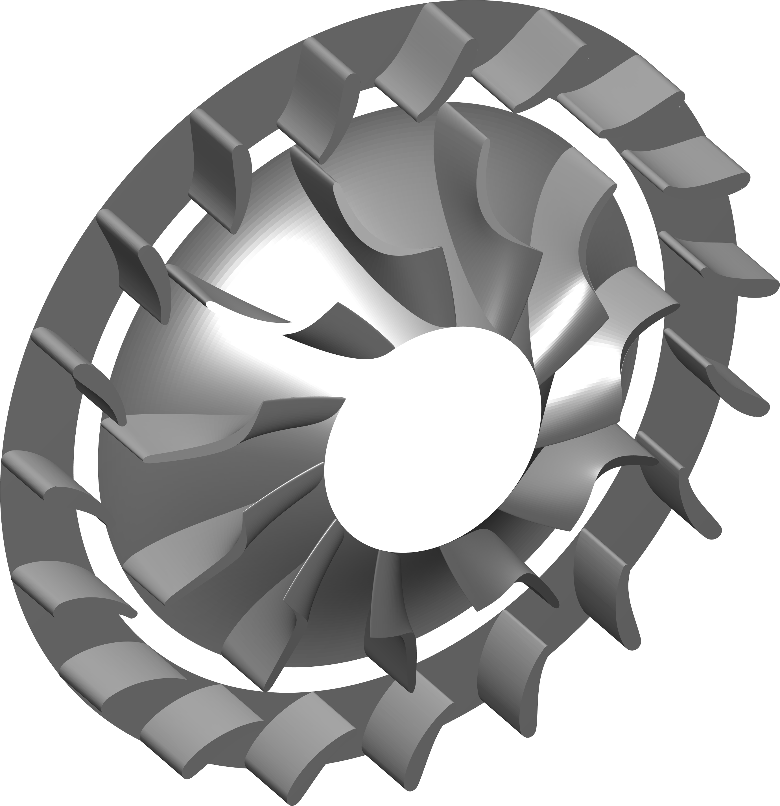
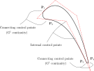
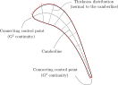
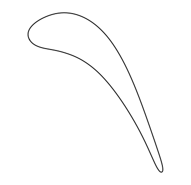
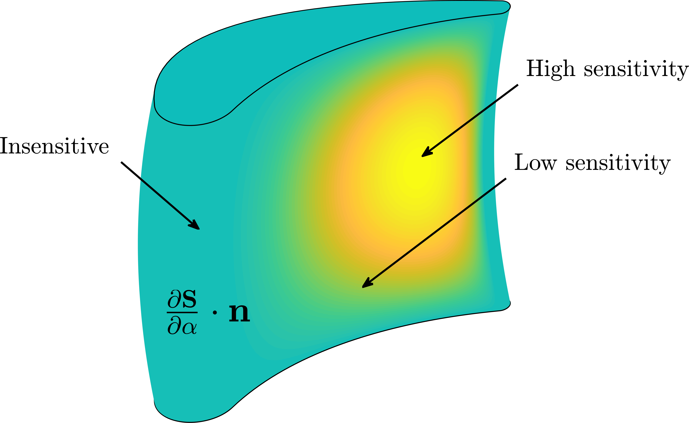
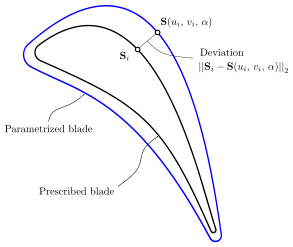

<p style="margin-bottom:1cm;"> </p>
<p align="center">
         
</p>
<p style="margin-bottom:1cm;"> </p>


ParaBlade is an open-source Python library for the parametrization of turbomachinery blades design using gradient-based optimization algorithms.


 

 

[](https://zenodo.org/badge/latestdoi/268081609)

## Discussion Board

GitHub discussion board is now open... Have a question ? Post it on the discussion board and engage with the community... 

## Install

`pip install git+https://github.com/NAnand-TUD/parablade.git#egg=parablade`

## Description

#### Unified parametrization

ParaBlade uses an unified parametrization method to describe the geometry of a wide range of turbomachinery blades including axial, radial, and mixed flow machines.

<p style="margin-bottom:1cm;"> </p>
<p align="center">
         
        &emsp; &emsp; &emsp; &emsp; &emsp;
        
        &emsp; &emsp;&emsp; &emsp; &emsp;
         
</p>
<p style="margin-bottom:1cm;"> </p>


#### Meridional channel

ParaBlade allows the user to specify an arbitrary shape of the blade in the axial-radial plane.
The meridional channel is described by a set of four B-Splines that define the:

- Leading edge
- Trailing edge
- Hub surface
- Shroud surface

<p style="margin-bottom:0cm;"> </p>
<p align="center">
        
        &emsp; &emsp; &emsp; &emsp; &emsp;
        
</p>
<p style="margin-bottom:1cm;"> </p>


#### Blade sections

ParaBlade also allows the user to specify a wide range of geometries for the blade sections.
Each blade section is defined by a set of B-Spline curves and the control points of these curves are computed using engineering parameters such as metal angles and thickness distribution.  
At the moment, there are two available section parametrizations: 

- Connecting arcs (G1 continuous)
- Camberline and thickness (G2 continuous) 

<p align="center">
        
        &emsp; &emsp; &emsp; &emsp; &emsp;
        
</p>


Both section parametrizations offer a rich design space that covers a wide range of blades, including compressor airfoils as well as reaction and impulse turbine blades.

<p align="center">
        
</p>
<p style="margin-bottom:0.5cm;"> </p>


#### CAD sensitivity

ParaBlade is able to provide the sensitivity of the surface with respect to the design variables using the complex step method. This information is required to solve shape optimization problems (e.g. maximize the blade isentropic efficiency) using gradient-based algortithms.


<p style="margin-bottom:2cm;"> </p>
<p align="center">
        
        &emsp; &emsp; &emsp; &emsp; &emsp;
        
</p>
<p style="margin-bottom:1cm;"> </p>


## Blade matching

ParaBlade is capable to finda parametrization to fit an given blade geometry. The solution of this _inverse problem_ is necessary to optimize the shape of an existing industrial design.

<p style="margin-bottom:0.5cm;"> </p>
<p align="center">
        
        &emsp; &emsp; &emsp; &emsp; &emsp;
        
</p>
<p style="margin-bottom:1cm;"> </p>


# Pre-requisites

Important: MAC users, please use pip to install python packages as anaconda can give conflicts when using tecplot library.
### Pip3  
```
sudo apt-get install python-setuptools python-dev build-essential
```

### MatPlotLib
Use pip3 to install matplotlib. For more information on matplotlib visit [here].  
[](https://matplotlib.org/)

```
sudo pip3 install matplotlib
```
### NumPy
Use pip3 to install numpy. For more information on numpy visit   
[](https://www.numpy.org/).

```
sudo pip3 install numpy
```

### SciPy
Use pip3 to install CoolProp. For more information on SciPy visit [here]  
[](https://www.scipy.org/).

```
sudo pip3 install scipy~=1.3.3
```

### Slack Client
If you wish to get notification on slack for your optimization. Please install the slack client else, just continue using
the code as it is. It would have no influence.
Use pip3 to install slack-client. For more information on slack-client visit [here].  
[]()

```
sudo pip3 install slackclient
```

Also add 
```
export SLACK_API_TOKEN="<slack legacy-token>"
```
in your \~/.bashrc file (\~/.bash_profile for Mac users)

To generate a slack legacy-tokens please visit   
[](https://api.slack.com/custom-integrations/legacy-tokens)

### TecPlot
Use pip3 to install pytecplot. Information on installation is available below.  

```
sudo pip3 install pytecplot
```
[](https://www.tecplot.com/docs/pytecplot/)

Add the tecplot libraries in your LIBRARY_PATH. Follow the instruction on pytecplot page. Link [https://www.tecplot.com/docs/pytecplot/install.html#id2]  
Important: Mac users please visit above link and read about MAC DYLD_LIBRARY_PATH
# Install
Run the command below
```
RunMe.sh
```
and follow the instructions to add the parablade bin files in your terminal environment.

# Development team

Parablade was developed by 

1. [**Roberto Agromayor**](https://www.ntnu.edu/employees/roberto.agromayor) - Postdoctoral Researcher, Norwegian University of Science and Technology (NTNU)  
2. [**Nitish Anand**](https://www.tudelft.nl/staff/n.anand/) - Postdoctoral Researcher, Propulsion & Power, Aerospace Engineering, Delft University of Technology (TUD) 

Feel free to drop us and e-mail if you have questions about the code or you have a bug to report. We would also love to hear about your experiences with Parablade in general.
[](mailto:roberto.agromayor@ntnu.no;n.anand@tudelft.nl?subject=ParaBlade:Query)

We would also like to acknowledge the following persons for their support during the conceptualization and developtment of Parablade

3. [**Matteo Pini**](https://www.tudelft.nl/en/staff/m.pini/?no_cache=1&cHash=) - Assistant Professor, Propulsion & Power, Aerospace Engineering, Delft University of Technology (TUD)
4. [**Jens-Dominik Müller**](https://www.sems.qmul.ac.uk/staff/j.mueller) - Reader, School of Engineering and Materials Science, Queen Mary University of London (QMUL)
5. [**Lars O. Nord**](https://www.ntnu.edu/employees/lars.nord) - Associate Professor, Department of Energy and Process Engineering, Norwegian University of Science and Technology (NTNU)


# References

Agromayor, R.; Anand, N.; Müller, J. D.; Pini, M.; and Nord, L. O. *A General Geometry Parametrization Method for Turbomachinery Blades* (submitted to Advances in Engineering Software).


